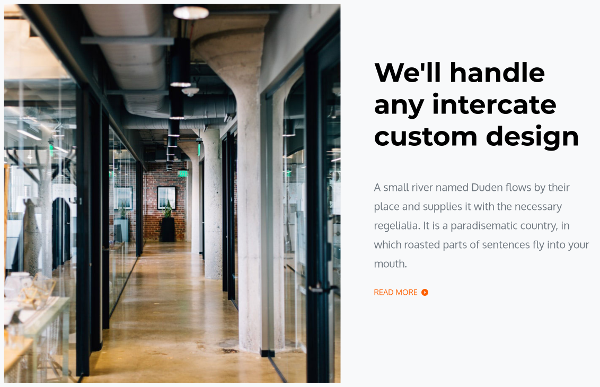

# industrial

This module is designed for marketers to create quickly and easily landing pages or microsites.
It contains a template, two pages sample and a collection of components :
* Carousel (2 types : heading and testimonial)

    
    
    
    
* Gallery image

    
    
* Features list

    
    
* Cards elements

    
    
* Text and illustration

    
    
* Navigation bar
* Footer components (about, contact, navigation)
* ...

This module contains a Jahia ready to use implementation of the free template [industrial](https://colorlib.com/wp/template/industrial/), based on the open source toolkit [Bootstrap 4](https://getbootstrap.com/docs/).
Following the concept of bootstrap 4, the template can be modified or used as his.

## Install

Before to use this module you need to install the dependence.
boostrap-4
forms
jexperience...

##Create a new website using `industrial` template set

1. Goto `Administration` mode
1. Click `Web Projects` entry and click `CREATE` in the right panel

    

1. Fill the website name and key with the name you want and click NEXT

    

1. Select the template set `industrial`
1. Choose modules to be deployed :
    1. `Bootstrap 4 Components` : this enable all default bootstrap 4 elements as the usefull `Layout and Grid`
    1. `Jahia Google Analytics` : this enable the `Google Analytics site settings` entry used to include your google analytics tag (explained later)
    
    

##Google Analytics site settings
Jahia offer to you an easy way to include your google analytics tag in your html page. To configure this feature follow the steps
1. Goto `Edit Mode`
1. In `PAGES` menu right click your site name and click `Edit`
1. In the edit form goto `Options` section
1. Enable the `Google Analytics site settings` entry :
    1. fill your *Google Analytics site ID*
    1. (optional) update the cookie live time
